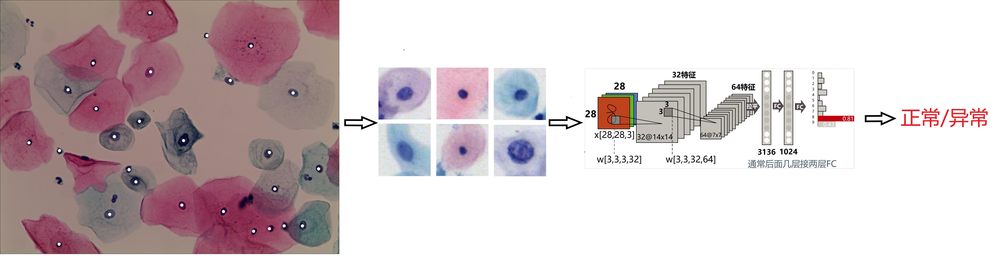
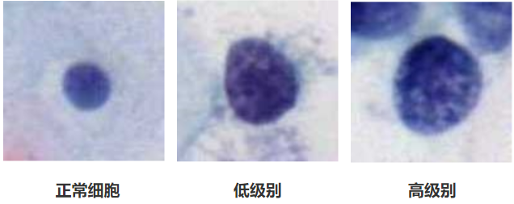

# DSCC-classifier
### 项目简介

该项目全称是**基于深度学习的TCT图片异常宫颈细胞自动识别方法**，该方法的整体流程描述如下：

- 通过MSER算法自动定位TCT图像中的宫颈细胞细胞核；
- 由细胞核质心坐标生成一个固定大小的ROI图片，用于代表该宫颈细胞；
- 基于海量的ROI图片数据集构建并训练宫颈细胞分类器（二分类：正常/异常）；
- 使用宫颈细胞分类器预测新的宫颈细胞ROI图片，完成对异常宫颈细胞的检测；

该方法的示意图如下所示：

### 数据集介绍

目前，我们已经有计划的将我们的样本图片做成一个公开的数据集。尽管我们原始的目的只是完成宫颈细胞的初筛（二分类任务），但是为了让数据集发挥更大的作用，我们将样本的类别划分为如下三类：

- 正常宫颈细胞
- 低级别异常宫颈细胞（ASCUS、ASCUS-H、LSIL）
- 高级别异常宫颈细胞（HSIL、CIS）

三类样本的示例图片如下所示：

数据集对应的论文及数据集具体下载地址待更新......

### 卷积神经网络分类模型

1. **VGG16 pretrain model:**

   待更新。。

2. **ResNet50：**

   待更新。。

3. **Densenet：**

   待更新。。

4. **MobileNet-V1：**

   待更新。。

5. **SSModel：**

   待更新。。

   